# 🏥 NHS Integration Engine: HL7 V2 to FHIR R4B Transformer

> **A containerised clinical data pipeline that simulates legacy NHS Patient Administration Systems (PAS), transforms raw HL7 V2.3 feeds into validated FHIR R4B bundles, and enforces clinical safety rules via an automated Sentinel auditor.**

---

## ⚡ The Problem

The NHS relies on legacy **HL7 V2** messaging (pipe-delimited text) for critical patient data. Modern interoperability demands **FHIR** (JSON).

Existing synthetic data tools (like *Synthea*) are heavily biased towards the **US Core Implementation Guide** (SSN, US addresses, ICD-10-CM). They fail to stress-test UK-specific integration challenges, such as **NHS Number validation (Modulus 11)**, UK postcode formatting, and the specific "dirty data" quirks found in British hospital systems (e.g., non-standard phone extensions).

## 🛠️ The Solution

I built a custom, Python-based integration engine that:

1. **Simulates** a realistic, messy UK Hospital feed (ADT & ORU messages).
2. **Transforms** legacy pipes into clean, strictly typed FHIR R4B resources.
3. **Validates** the output against clinical safety rules (e.g., biological plausibility, checksums).
4. **Orchestrates** the entire pipeline using Docker microservices.

---

## 🏗️ Architecture

The system follows a linear **Extract-Transform-Load-Audit (ETLA)** pattern, containerised via Docker Compose.

```mermaid
graph LR
    A[🏭 PAS Simulator] -->|Raw HL7 V2.3| B(Volume: /data)
    B -->|Ingest| C[🤖 Integration Engine]
    C -->|FHIR R4B Bundle| B
    B -->|Scan| D[🛡️ Sentinel Auditor]
    D -->|HTML Report| E[Artifacts]

```



### 1. The Source: `pas-simulator` (legacy_feed.py)

* Generates **HL7 V2.3** messages:
* **ADT^A01:** Patient Admissions.
* **ORU^R01:** Observation Results (Vital Signs).


* **Features:**
* Injects realistic "dirty data" (e.g., `07700 900 461 x123` phone numbers).
* Generates valid **NHS Numbers** using the Modulus 11 algorithm.
* Randomly triggers **AL1 (Allergy)** segments with severity codes.


### 2. The Engine: `integration-engine` (forge.py)

* Parses raw HL7 and maps it to **FHIR R4B** resources.
* **Key Engineering:**
* **Normalization:** Cleans messy input (e.g., regex stripping of phone extensions).
* **Versioning:** Explicitly targets `fhir.resources.R4B` to resolve R4/R5 library conflicts.
* **Complex Mapping:** Converts flat HL7 segments (`PID-13`) into nested FHIR objects (`Patient.telecom`).
* **Enum Handling:** Maps HL7 severity (`SV`) to FHIR criticality (`high`).


### 3. The Gatekeeper: `data-sentinel` (sentinel.py)

* A post-processing auditor that acts as a "Quality Gate."
* **Validation Rules:**
* **NHS Number Integrity:** Re-calculates checksums to detect corruption.
* **Biological Plausibility:** Rejects impossible vitals (e.g., Heart Rate > 300 bpm).
* **Structure:** Ensures all Bundles are valid JSON and strictly typed.


* **Output:** Generates a visual `audit_report.html` for stakeholders.

---

## 🚀 Getting Started

### Prerequisites

* Docker & Docker Compose installed.

### Installation & Run

No local Python installation is required. The entire stack runs in isolated containers.

```bash
# 1. Clone the repository
git clone https://github.com/yourusername/nhs-integration-engine.git
cd nhs-integration-engine

# 2. Build and Run the Stack
docker-compose up --build

```

### Configuration

You can control the volume of data generated by modifying the `docker-compose.yml` environment variables:

```yaml
services:
  pas-simulator:
    environment:
      - BATCH_SIZE=50  # Generates 50 HL7 messages per run

```

---

## 📂 Project Structure

```text
├── data/                  # Shared volume for inter-container communication
│   ├── hl7_inbound/       # Generated legacy files (.hl7)
│   ├── raw/               # Transformed FHIR Bundles (.json)
│   ├── accepted/          # Validated & Cleaned records
│   └── rejected/          # Quarantine for failed records
├── src/
│   ├── legacy_feed.py     # Source System Simulator
│   ├── forge.py           # Integration Engine Core
│   ├── sentinel.py        # Quality & Safety Validator
│   └── chaos.py           # (Optional) Chaos Engineering script
├── Dockerfile             # Container definition
├── docker-compose.yml     # Orchestration logic
├── requirements.txt       # Python dependencies
└── README.md              # Documentation

```

---

## 🛡️ Clinical Safety & Compliance

This engine was designed with **DCB0129** (Clinical Risk Management) principles in mind.

* **Data Lineage:** Every FHIR resource can be traced back to its original HL7 file.
* **Fail-Safe:** The `sentinel` service is decoupled; if the transformer produces invalid JSON, the sentinel catches it before it reaches the "Accepted" bucket.
* **Standardisation:** Uses official LOINC codes (e.g., `8867-4` for Heart Rate) and SNOMED-CT for allergy mapping.

## 👨‍💻 Author

**Rasswanth Senthilkumar** *Healthcare Integration Engineer | Digital Services Developer*