# 🏥 NHS Integration Engine: HL7 V2 to FHIR R4B Transformer

> **A containerised clinical data pipeline that simulates legacy NHS Patient Administration Systems (PAS), transforms raw HL7 V2.3 feeds into validated FHIR R4B bundles, and enforces clinical safety rules via an automated Sentinel auditor.**

*(Run the stack to see the interactive Streamlit Dashboard)*

---

## ⚡ The Problem

The NHS relies on legacy **HL7 V2** messaging (pipe-delimited text) for critical patient data. Modern interoperability demands **FHIR** (JSON).

Existing synthetic data tools (like *Synthea*) are heavily biased towards the **US Core Implementation Guide** (SSN, US addresses, ICD-10-CM). They fail to stress-test UK-specific integration challenges, such as **NHS Number validation (Modulus 11)**, UK postcode formatting, and the specific "dirty data" quirks found in British hospital systems.

## 🛠️ The Solution

I built a custom, Python-based integration engine that:

1. **Simulates** a realistic, messy UK Hospital feed (ADT & ORU messages).
2. **Transforms** legacy pipes into clean, strictly typed FHIR R4B resources.
3. **Stresses** the system via a "Semantic Chaos Engine" that injects clinical and administrative errors.
4. **Validates** the output using a "Sentinel" auditor that maintains a persistent defect lifecycle (Active vs. Resolved).
5. **Visualises** everything in a real-time Command Center.

---

## 🏗️ Architecture

The system follows an **Orchestrated ETLA (Extract-Transform-Load-Audit)** pattern, controlled via a UI.

```mermaid
graph TD
    User[👨‍⚕️ User / Dashboard] -->|Trigger| Orchestrator{Docker Compose}
    Orchestrator -->|1. Generate| PAS[🏭 PAS Simulator]
    PAS -->|HL7 V2.3| Volume[(Volume: /data)]
    Volume -->|2. Ingest| Engine[🤖 Integration Engine]
    Engine -->|FHIR R4B| Volume
    Orchestrator -->|3. Inject Chaos| Chaos[🔥 Chaos Engine]
    Chaos -->|Corrupt Data| Volume
    Orchestrator -->|4. Audit| Sentinel[🛡️ Sentinel Auditor]
    Sentinel -->|Log Update| DB[(Audit Log JSON)]
    DB -->|Visualise| User

```



### 1. The Source: `pas-simulator`

* Generates **HL7 V2.3** messages (ADT^A01, ORU^R01).
* **UK Localisation:** Generates valid **NHS Numbers** (Modulus 11 algorithm) and UK Postcodes.
* **Dirty Data:** Injects realistic noise (e.g., `07700 900 461 x123` phone extensions).

### 2. The Engine: `integration-engine`

* Parses raw HL7 and maps it to **FHIR R4B** resources.
* **Complex Mapping:** Converts flat HL7 segments (`PID-13`) into nested FHIR objects (`Patient.telecom`).
* **Versioning:** Targets `fhir.resources.R4B` to avoid R4/R5 library conflicts.

### 3. The Chaos: `chaos.py` (Resilience Testing)

* A "Semantic Virus" that inspects generated JSON and corrupts specific fields to test the Sentinel.
* **Clinical Errors:** Injects impossible vitals (e.g., Heart Rate > 300, BP 999/999) or future timestamps.
* **Administrative Errors:** Corrupts NHS Number checksums or removes mandatory family names.

### 4. The Gatekeeper: `data-sentinel`

* **Validation Rules:** Enforces biological plausibility and structural integrity.
* **Lifecycle Management:** Maintains a persistent `rejection_log.json`.
* **🔴 Active:** New error detected.
* **✅ Resolved:** Previous error fixed in subsequent run.


---

## 🖥️ The Command Center (Dashboard)

The project includes a **Streamlit** dashboard for non-technical stakeholders to control the pipeline.

* **Controls:** Adjust batch size (10-1000 records) and toggle "Chaos Mode."
* **Live Metrics:** Real-time counters for processed, accepted, and rejected records.
* **Drill Down:** Interactive table to inspect rejected records and view raw JSON differences.

---

## 🚀 Getting Started

### Prerequisites

* Docker & Docker Compose installed.

### Installation & Run

No local Python installation is required. The entire stack runs in isolated containers.

```bash
# 1. Clone the repository
git clone https://github.com/rasna-skumar1306/synthetichl7uk.git
cd synthetichl7uk

# 2. Build and Run the Stack
docker-compose up --build

# 3. Access the Dashboard
# Open your browser to: http://localhost:8501

```

---

## 📂 Project Structure

```text
├── data/                  # Shared volume for inter-container communication
│   ├── hl7_inbound/       # Generated legacy files (.hl7)
│   ├── raw/               # Transformed FHIR Bundles (.json)
│   └── rejection_log.json # Persistent Audit Trail
├── src/
│   ├── legacy_feed.py     # Source System Simulator
│   ├── forge.py           # Integration Engine Core
│   ├── sentinel.py        # Quality & Safety Validator
│   ├── chaos.py           # Clinical Chaos Generator
│   └── dashboard.py       # Streamlit UI
├── Dockerfile             # Container definition
├── docker-compose.yml     # Orchestration logic
├── requirements.txt       # Python dependencies
└── README.md              # Documentation

```

---

## 🛡️ Clinical Safety & Compliance

This engine was designed with **DCB0129** (Clinical Risk Management) principles in mind.

* **Data Lineage:** Every FHIR resource can be traced back to its original HL7 file.
* **Fail-Safe:** The `sentinel` service acts as a Safety Check; invalid clinical data (e.g., impossible BP) is quarantined before ingestion.
* **Standardisation:** Uses official LOINC codes (e.g., `8867-4`) and SNOMED-CT mappings.

## 👨‍💻 Author

**Rasswanth Senthilkumar**
*Healthcare Integration Engineer | Digital Services Developer*